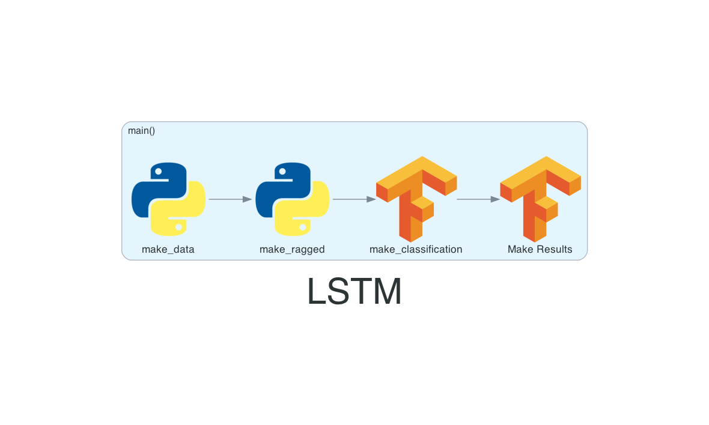

# The Data Science Workbench
A pet project of Duck Bongos' that allows them to learn all sorts of things related to Machine Learning techniques. This includes ancillary things like spinning up generic ML serving servers, different strategies of writing unit tests, building documentation in Sphinx - anything and everything.


## Documentation Exercises:
### Make charts with `diagrams`.
[Installation and usage documentation](https://diagrams.mingrammer.com/)

This is generally how the code flows



### Sphinx Documentation
Using `sphinx-autoapi` to build the documentation.

Using `sphinx-autobuild` to create a server that automatically regenerates every time a docs change is made.
```
sphinx-autobuild docs/source docs/_build/html
```

using the `furo` [theme](https://github.com/pradyunsg/furo/blob/main/src/furo/assets/styles/variables/_colors.scss). 

Use pandoc to create README.rst
```
pandoc --from markdown --to rst --no-highlight README.md > docs/README.rst
```


### Create code graphs (requires graphviz)
First run
```
python3 docs/analyze_code.py
```
Then follow it up with
```
dot -Tpng docs/call_graph.dot -o docs/call_graph.png
```

## Requirements
```
sphinx-autoapi==3.1.1
sphinx-autobuild  # also very useful `sphinx-autobuild ./source/ ./_build/html`
furo==2024.5.6
graphviz==0.20.3
pandoc # haskell, had to `brew install pandoc`
diagrams==0.23.4
```
