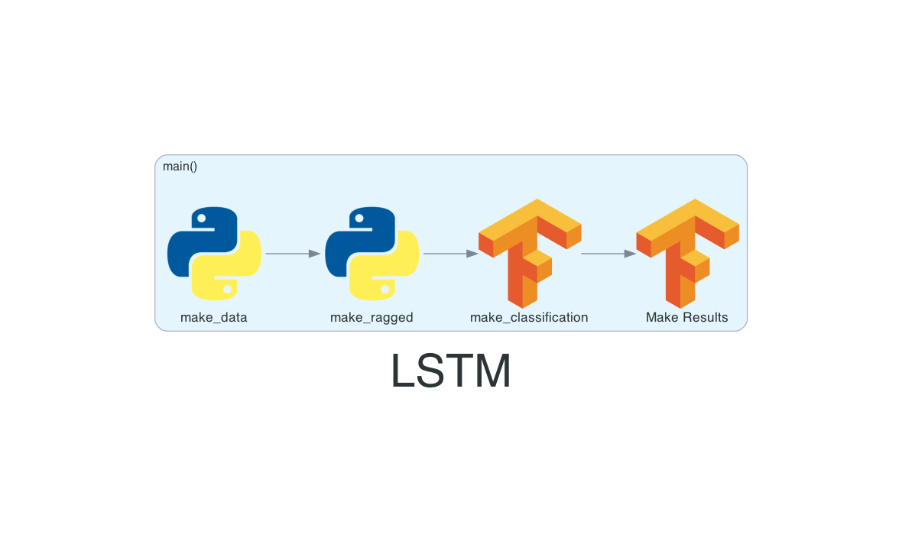
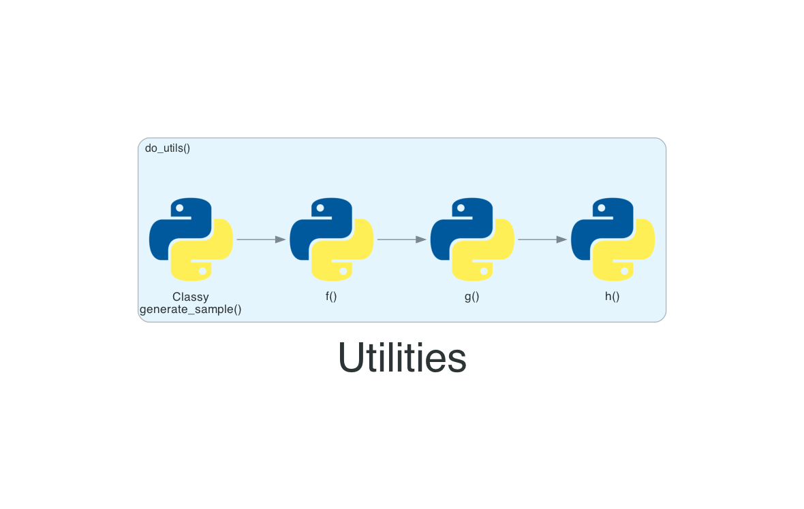

Visualizations
==============

Where we keep all of our visualizations.

.. toctree::

This is generally how the code flows |LSTM| |Utils|

Generated
=========
These are all generated flows: |lstm_pipeline_main|

.. |lstm_pipeline_main| image:: ../img/generated/lstm_pipeline_main.png